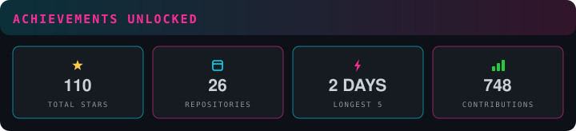

<p align="center">
  
</p>

```text
$ cat identity.txt
```

> **Security Researcher & Tool Builder** — focused on offensive security,
> threat intelligence, and AI-powered automation.
> Building tools that make recon faster and reporting painless.
>
> **安全研究员 & 工具建造者** —— 专注攻防渗透、威胁情报与 AI 自动化，
> 让信息收集更快、报告输出更省心。

```text
$ cat focus.txt
```

> 🎯 **Bug Hunting** — EDUSRC & enterprise SRC · 教育 SRC 与企业 SRC 漏洞挖掘中
>
> 🛠 **Tool Building** — recon & automation tooling · 持续打磨侦察与自动化工具链
>
> 🤖 **AI × Security** — LLM-driven security workflows · 探索大模型驱动的安全工作流

```text
$ ls ~/arsenal --sort=stars
```

## 🔫 Featured Arsenal · 精选武器库

<table>
<tr>
<td width="50%">

[🔧 **fscan-toolkit**](https://github.com/chu0119/fscan-toolkit)&nbsp;
[](https://github.com/chu0119/fscan-toolkit)&nbsp;


*GUI suite for fscan — command builder + report parser, zero-dependency.*

fscan 图形化套件：命令生成器 + 报告解析器。

</td>
<td width="50%">

[🛡 **zhidun**](https://github.com/chu0119/zhidun)&nbsp;
[](https://github.com/chu0119/zhidun)&nbsp;


*AI-driven web log security analyzer — cyberpunk-themed threat hunting.*

星川智盾：AI 驱动的网站日志安全分析系统。

</td>
</tr>
<tr>
<td width="50%">

[🌲 **DarkForest-Hunter**](https://github.com/chu0119/DarkForest-Hunter)&nbsp;
[](https://github.com/chu0119/DarkForest-Hunter)&nbsp;


*DeepSeek API-key security scanner — 14 sources, 238 queries.*

黑暗森林猎人：DeepSeek API 密钥泄露扫描器。

</td>
<td width="50%">

[🛰 **xingchuan-ti**](https://github.com/chu0119/xingchuan-ti)&nbsp;
[](https://github.com/chu0119/xingchuan-ti)&nbsp;


*Threat-intel assistant — select IP/domain, multi-source weighted verdict.*

星川威胁情报助手：划词识别，多源加权研判。

</td>
</tr>
<tr>
<td width="50%">

[📡 **tg-monitor-v2**](https://github.com/chu0119/tg-monitor-v2)&nbsp;
[](https://github.com/chu0119/tg-monitor-v2)&nbsp;


*Telegram group monitoring — keyword alerts, analytics & dashboard.*

听风追影：TG 群组实时监控告警与可视化大屏。

</td>
<td width="50%">

[🎯 **edusrc-hunter**](https://github.com/chu0119/edusrc-hunter)&nbsp;
[](https://github.com/chu0119/edusrc-hunter)&nbsp;


*EDUSRC hunting skill — Burp-MCP driven recon → scan → report.*

教育 SRC 漏洞挖掘技能：Burp MCP 全流程驱动。

</td>
</tr>
</table>

```text
$ sudo ./load_modules.sh
```

## 🛠 Tech Stack · 技术栈

**Languages**


**Security**


**AI & Automation**


```text
$ ./monitor --live
```

## 📊 Stats & Achievements · 数据与成就

> Stats & achievements auto-generated daily by GitHub Actions — zero external service dependency

<p align="center">
  
</p>
<p align="center">
  
</p>
<p align="center">
  
</p>

## 📡 Recent Activity · 最近动态

<!-- BEGIN ACTIVITY -->
- ⭐ **zhaoxuya520/reverse-skill** — starred it
- 📦 **sqlmap-toolkit** — released it
- 🚀 **AegisIR** — pushed to it
<!-- END ACTIVITY -->

```text
$ ping me
```

## 📮 Contact · 联系我

<p align="left">
  <a href="mailto:chu0119@foxmail.com"></a>&nbsp;&nbsp;
  <a href="https://github.com/chu0119"></a>
</p>

```text
$ exit
```

<p align="center">
  
</p>
