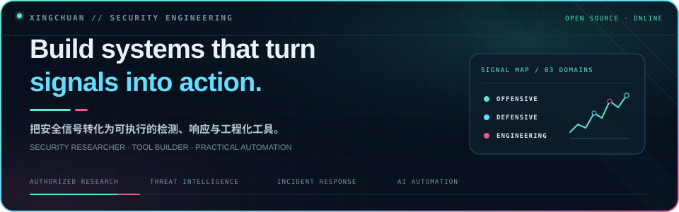
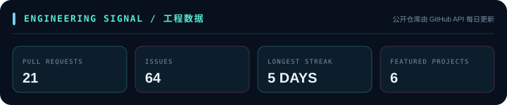
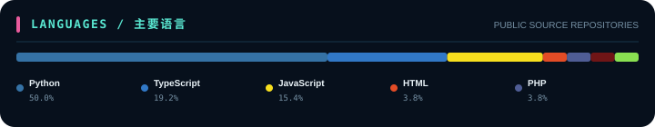

<p align="center">
  
</p>

```text
$ cat identity.txt
```

> **Security Researcher & Tool Builder** — focused on offensive security,
> threat intelligence, and AI-powered automation.
> Building tools that make recon faster and reporting painless.

```text
$ ls ~/arsenal --sort=stars
```

## 🔫 Featured Arsenal

| Project | What it does |
|---------|-------------|
| 🛡 [**zhidun**](https://github.com/chu0119/zhidun) | AI-driven web log security analyzer — cyberpunk-themed threat hunting |
| 🔧 [**fscan-toolkit**](https://github.com/chu0119/fscan-toolkit) | GUI suite for fscan — command builder + report parser, zero-dependency |
| 🌲 [**DarkForest-Hunter**](https://github.com/chu0119/DarkForest-Hunter) | DeepSeek API key security scanner — 14 sources, 238 queries |
| 🛰 [**xingchuan-ti**](https://github.com/chu0119/xingchuan-ti) | Threat-intel assistant — select IP/domain, multi-source weighted verdict |

```text
$ sudo ./load_modules.sh
```

## 🛠 Tech Stack

**Languages**


**Security**


**AI & Automation**


```text
$ ./monitor --live
```

## 📊 Stats

> Stats auto-generated daily by GitHub Actions — zero external service dependency

<p align="center">
  
</p>
<p align="center">
  
</p>

## 📡 Recent Activity

<!-- BEGIN ACTIVITY -->
- ⭐ **huangguang1999/ccstatusline-zh** — starred it
- 🚀 **xingchuan-ti** — pushed to it
- 🚀 **uusec-waf** — pushed to it
<!-- END ACTIVITY -->

```text
$ exit
```

<p align="center">
  
</p>
