

  

  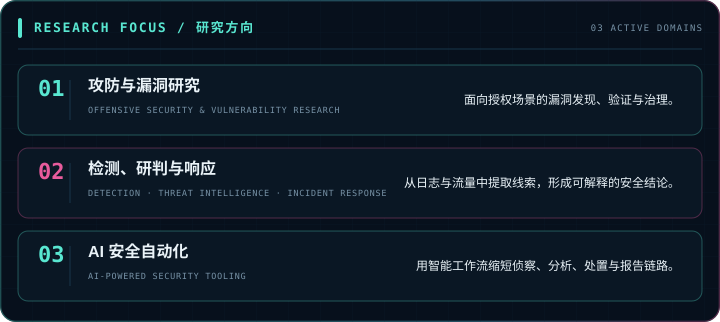

  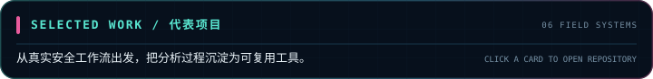

  <a href="https://github.com/chu0119/fscan-toolkit">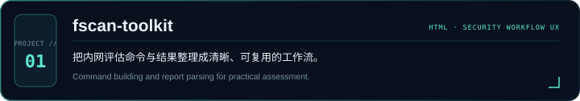</a>

  <a href="https://github.com/chu0119/zhidun">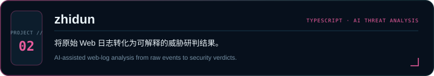</a>

  <a href="https://github.com/chu0119/DarkForest-Hunter">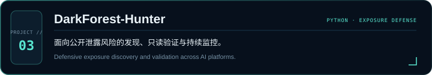</a>

  <a href="https://github.com/chu0119/log-audit">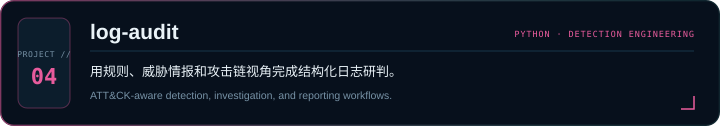</a>

  <a href="https://github.com/chu0119/xingchuan-ti">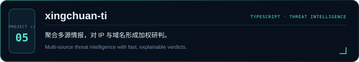</a>

  <a href="https://github.com/chu0119/AegisIR">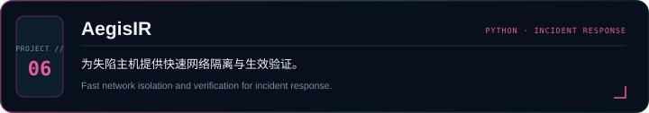</a>

  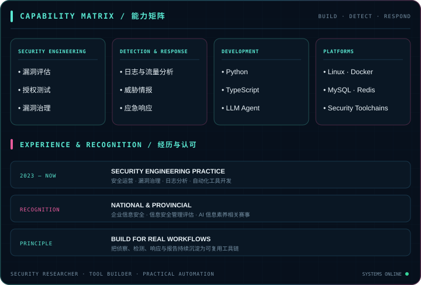

  

  

  

  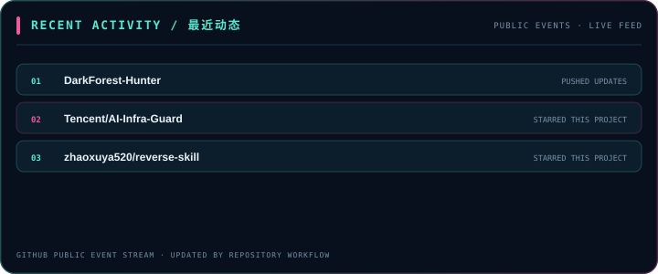

  <a href="https://github.com/chu0119?tab=repositories">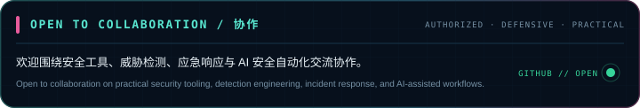</a>

<strong>文字版项目说明与无障碍内容 · Accessible text version</strong>

## 星川 / xingchuan

**Security Researcher & Tool Builder**

把安全信号转化为可执行的检测、响应与工程化工具。 
Turning security signals into practical detection, response, and engineering systems.

### 研究方向 · Focus

- **攻防与漏洞研究 / Offensive Security & Vulnerability Research** — 面向授权场景的漏洞发现、验证与治理。
- **检测、研判与响应 / Detection, Threat Intelligence & IR** — 从日志与流量中提取线索，形成可解释的安全结论。
- **AI 安全自动化 / AI-powered Security Tooling** — 用智能工作流缩短侦察、分析、处置与报告链路。

### 代表项目 · Selected Work

- [fscan-toolkit](https://github.com/chu0119/fscan-toolkit) — Security Workflow UX
- [zhidun](https://github.com/chu0119/zhidun) — AI Threat Analysis
- [DarkForest-Hunter](https://github.com/chu0119/DarkForest-Hunter) — Exposure Defense
- [log-audit](https://github.com/chu0119/log-audit) — Detection Engineering
- [xingchuan-ti](https://github.com/chu0119/xingchuan-ti) — Threat Intelligence
- [AegisIR](https://github.com/chu0119/AegisIR) — Incident Response

### 能力矩阵 · Capabilities

Security Engineering · Detection & Response · Python · TypeScript · LLM Agent · Linux · Docker · MySQL · Redis

### 经历与认可 · Experience & Recognition

- **2023 — Now:** Security engineering practice covering operations, vulnerability governance, log analysis, and automation tooling.
- **Recognition:** National and provincial experience in enterprise information security, security management assessment, and AI literacy competitions.
- **Principle:** Build for real workflows — turn reconnaissance, detection, response, and reporting into reusable toolchains.

### 开源数据 · Open Source Signal

Metrics are generated daily from explicitly public repositories through the GitHub API. No private activity or third-party stats image service is used.

### 最近动态 · Recent Activity

<!-- BEGIN ACTIVITY -->
- 🚀 [**DarkForest-Hunter**](https://github.com/chu0119/DarkForest-Hunter) — pushed updates
- ⭐ [**Tencent/AI-Infra-Guard**](https://github.com/Tencent/AI-Infra-Guard) — starred this project
- ⭐ [**zhaoxuya520/reverse-skill**](https://github.com/zhaoxuya520/reverse-skill) — starred this project
<!-- END ACTIVITY -->

### 协作 · Collaboration

欢迎围绕安全工具、威胁检测、应急响应与 AI 安全自动化交流协作。 
Open to collaboration on practical security tooling, detection engineering, incident response, and AI-assisted security workflows.

All security research and tooling is intended for authorized testing, defensive research, and education.

